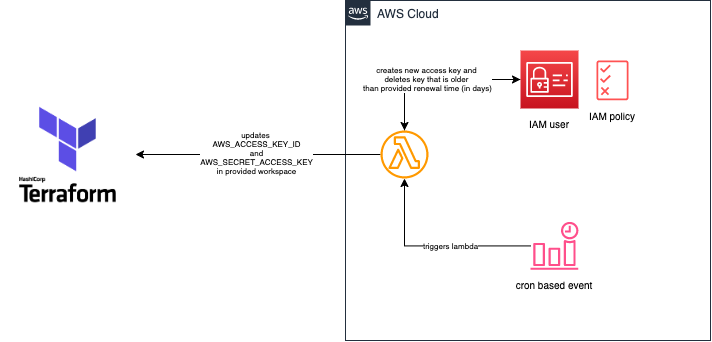
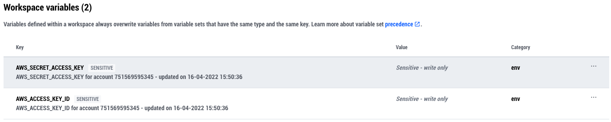

# TERRAFORM AWS TFC IAM CREDENTIALS ROTATION

A module that enables automatic rotation of AWS iam credentials and setting them up in a TFC workspace
to meet security/compliance standards.

## Idea

Developers/End-users never need to access the AWS management console to deploy resources.
In the target AWS account an IAM policy must exist that the new iam user uses.
An administrator initially deploys this module in a workspace with his credentials.
Afterwards the lambda function in this module is executed after deployment, creates a new AWS Access Key
and sets them as sensitive environment variables in the TFC workspace.
Hence, the developer/end-user **never** sees these credentials and can start leveraging the TFC workspace for infrastructure deployments.

In addition, the `RENEWAL_TIME` variable allows to customize the rotation interval (in days). A cron expression checks the validity of the key.
If e.g. `RENEWAL_TIME=10` and the lambda function computes that the access key is older than 10 days it will be deleted and a new one is created.

## Architecture

## Example

## Prerequisites

- [X] Terraform Cloud/Enterprise organization and workspace
- [X] Terraform Cloud/Enterprise API token
- [X] An already existing AWS iam policy that the AWS iam user receives (must be named like this: <tfc_deployer_user_name>-<tfc_workspace_name>)

<!-- BEGINNING OF PRE-COMMIT-TERRAFORM DOCS HOOK -->
## Requirements

| Name | Version |
|------|---------|
|  [terraform](#requirement\_terraform) | >= 1.1.1  |
|  [aws](#requirement\_aws) | >= 4.1.0 |

## Providers

| Name | Version |
|------|---------|
|  [archive](#provider\_archive) | 2.2.0 |
|  [aws](#provider\_aws) | 4.10.0 |

## Modules

No modules.

## Resources

| Name | Type |
|------|------|
| [aws_cloudwatch_event_rule.tfc_deployer_cw_event_rule](https://registry.terraform.io/providers/hashicorp/aws/latest/docs/resources/cloudwatch_event_rule) | resource |
| [aws_cloudwatch_event_target.tfc_deployer_cw_event_target](https://registry.terraform.io/providers/hashicorp/aws/latest/docs/resources/cloudwatch_event_target) | resource |
| [aws_cloudwatch_log_group.tfc_deployer_lambda_log_group](https://registry.terraform.io/providers/hashicorp/aws/latest/docs/resources/cloudwatch_log_group) | resource |
| [aws_iam_role.tfc_deployer_lambda_role](https://registry.terraform.io/providers/hashicorp/aws/latest/docs/resources/iam_role) | resource |
| [aws_iam_user.tfc_deployer_user](https://registry.terraform.io/providers/hashicorp/aws/latest/docs/resources/iam_user) | resource |
| [aws_iam_user_policy_attachment.tfc_deployer_user_policy](https://registry.terraform.io/providers/hashicorp/aws/latest/docs/resources/iam_user_policy_attachment) | resource |
| [aws_lambda_function.tfc_deployer_lambda](https://registry.terraform.io/providers/hashicorp/aws/latest/docs/resources/lambda_function) | resource |
| [aws_lambda_permission.tfc_deployer_lambda_permissions](https://registry.terraform.io/providers/hashicorp/aws/latest/docs/resources/lambda_permission) | resource |
| [archive_file.tfc_deployer_lambda](https://registry.terraform.io/providers/hashicorp/archive/latest/docs/data-sources/file) | data source |
| [aws_caller_identity.this](https://registry.terraform.io/providers/hashicorp/aws/latest/docs/data-sources/caller_identity) | data source |
| [aws_iam_policy.tfc_deployer_user_policy](https://registry.terraform.io/providers/hashicorp/aws/latest/docs/data-sources/iam_policy) | data source |
| [aws_iam_policy_document.tfc_deployer_lambda_policy_inline](https://registry.terraform.io/providers/hashicorp/aws/latest/docs/data-sources/iam_policy_document) | data source |
| [aws_lambda_invocation.tfc_deployer_lambda_invocation](https://registry.terraform.io/providers/hashicorp/aws/latest/docs/data-sources/lambda_invocation) | data source |
| [aws_region.this](https://registry.terraform.io/providers/hashicorp/aws/latest/docs/data-sources/region) | data source |

## Inputs

| Name | Description | Type | Default | Required |
|------|-------------|------|---------|:--------:|
|  [custom\_ca\_bundle\_path](#input\_custom\_ca\_bundle\_path) | Path of custom ca bundle for AWS Lambda (must be uploaded with the zip file) | `string` | `null` | no |
|  [default\_tags](#input\_default\_tags) | Default tags to apply to all resources | `map(any)` | `{}` | no |
|  [region](#input\_region) | Region to deploy resources to | `string` | `"eu-central-1"` | no |
|  [ssl\_verify](#input\_ssl\_verify) | Activate/Deactivate ssl for lambda updating the credentials in tfc | `string` | `"True"` | no |
|  [tfc\_deployer\_schedule\_expression](#input\_tfc\_deployer\_schedule\_expression) | Cron expression when to check tfc credentials for validity | `string` | `"cron(0 20 * * ? *)"` | no |
|  [tfc\_deployer\_user\_credential\_renewal](#input\_tfc\_deployer\_user\_credential\_renewal) | Days after when the credentials in tfc have to be renewed | `number` | `10` | no |
|  [tfc\_deployer\_user\_name](#input\_tfc\_deployer\_user\_name) | Name of the user tfc uses for deployments (will be suffixed with tfc\_workspace\_name) | `string` | `"tfc-deployer"` | no |
|  [tfc\_organization\_name](#input\_tfc\_organization\_name) | Name of the tfc organization | `string` | n/a | yes |
|  [tfc\_token\_credential\_rotation](#input\_tfc\_token\_credential\_rotation) | API token to authenticate against tfc to enable credential rotation | `string` | n/a | yes |
|  [tfc\_url](#input\_tfc\_url) | URL of tfc | `string` | `"https://app.terraform.io"` | no |
|  [tfc\_workspace\_id](#input\_tfc\_workspace\_id) | ID of the tfc workspace | `string` | n/a | yes |
|  [tfc\_workspace\_name](#input\_tfc\_workspace\_name) | Name fo the tfc workspace | `string` | n/a | yes |

## Outputs

| Name | Description |
|------|-------------|
|  [tfc\_deployer\_lambda\_function\_arn](#output\_tfc\_deployer\_lambda\_function\_arn) | ARN of the lambda function that sets credentials in tfc |
|  [tfc\_deployer\_user\_arn](#output\_tfc\_deployer\_user\_arn) | ARN of the tfc deployer user |
<!-- END OF PRE-COMMIT-TERRAFORM DOCS HOOK -->